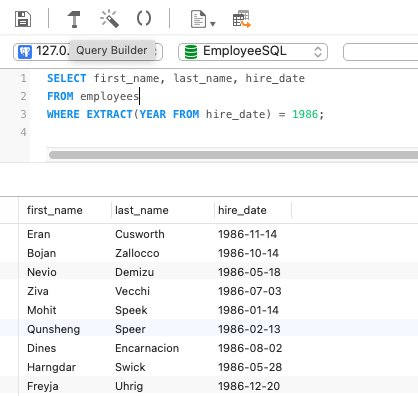

# Module 9 Challenge

For this project, I'll design the tables to hold the data from the CSV files, import the CSV files into a SQL database, and then answer questions about the data. In other words, I'll be performing data modeling, data engineering, and data analysis.

# Employee Database Challenge

This challenge is divided into three parts: data modeling, data engineering, and data analysis.

## First Task: Entity Relationship Diagram (ERD)

- Sketch an Entity Relationship Diagram of the tables.
- 

## Second Task: Table Schema Creation

- Create a table schema for each of the six CSV files.
- SQL to create the database and the tables.
- Specify the data types, primary keys, foreign keys, and other constraints.
- [Create SQL DB & Tables](EmployeeSQL/SQL_create_statements/SQL_Create_all_tables.sql)
  

### SQL File Location
The SQL file to create the database and tables can be found at:


## Third Task: Data Analysis

### Queries and Results

1. **List the employee number, last name, first name, sex, and salary of each employee.**
```
SELECT e.emp_no, e.last_name, e.first_name, e.sex, s.salary
FROM employees e
JOIN salaries s ON e.emp_no = s.emp_no;
```

   

2. **List the first name, last name, and hire date for the employees who were hired in 1986.**
```
SELECT first_name, last_name, hire_date
FROM employees
WHERE EXTRACT(YEAR FROM hire_date) = 1986;
```
   

3. **List the manager of each department along with their department number, department name, employee number, last name, and first name.**

```
SELECT dm.dept_no, d.dept_name, dm.emp_no, e.last_name, e.first_name
FROM dept_manager dm
JOIN departments d ON dm.dept_no = d.dept_no
JOIN employees e ON dm.emp_no = e.emp_no;
```
   

4. **List the department number for each employee along with that employee’s employee number, last name, first name, and department name.**
```
SELECT de.dept_no, de.emp_no, e.last_name, e.first_name, d.dept_name
FROM dept_emp de
JOIN employees e ON de.emp_no = e.emp_no
JOIN departments d ON de.dept_no = d.dept_no;
```
   

5. **List the first name, last name, and sex of each employee whose first name is Hercules and whose last name begins with the letter B.**
```
SELECT first_name, last_name, sex
FROM employees
WHERE first_name = 'Hercules' AND last_name LIKE 'B%';
```
   

6. **List each employee in the Sales department, including their employee number, last name, and first name.**
```
SELECT e.emp_no, e.last_name, e.first_name
FROM employees e
JOIN dept_emp de ON e.emp_no = de.emp_no
JOIN departments d ON de.dept_no = d.dept_no
WHERE d.dept_name = 'Sales';
```
   

7. **List each employee in the Sales and Development departments, including their employee number, last name, first name, and department name.**
```
SELECT e.emp_no, e.last_name, e.first_name, d.dept_name
FROM employees e
JOIN dept_emp de ON e.emp_no = de.emp_no
JOIN departments d ON de.dept_no = d.dept_no
WHERE d.dept_name IN ('Sales', 'Development');
```
   

8. **List the frequency counts, in descending order, of all the employee last names (that is, how many employees share each last name).**
```
SELECT last_name, COUNT(*) as frequency
FROM employees
GROUP BY last_name
ORDER BY frequency DESC;
```
   
